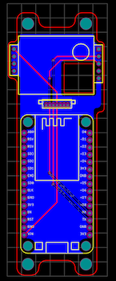

# Aria Fissa Project
This project hopes to simplify monitoring CO2 levels using Home-Assistant or the more compatible MQTT protocol. 
Aria Fissa uses the easily procurable CO2 sensor (MH-Z19) and the NodeMCU v3.

## Ingredients

 - MH-Z19 sensor - [Link](https://esphome.io/components/sensor/mhz19.html)
 -  Microcontroller - NodeMCU v3 - [Link](https://docs.zerynth.com/latest/official/board.zerynth.nodemcu3/docs/index.html) 
	- The Aria Fissa PCB might be compatible with other ESP8266  board. Verify the pin count and the RX/TX pin locations 
- Host - You'll need a [MQTT broker](https://en.wikipedia.org/wiki/MQTT#MQTT_broker) or [Home-Assistant](https://www.home-assistant.io/getting-started/) host 
- Computer to configure the board and your host 
- Soldering iron, solder, flux, and other hobbiest tools/consumables

### Optional 
There are few variations of the MH-Z19 - The Aria Fissa board attempts compatablity with most of the available versions. 

There are two options to mount the MH-Z19 to the PCB: 
 -  MH-Z19 by using 2.54mm pitch breakaway male pin headers ( 9 total pins needed) 
 -  There are through-hole solder pads located near the middle of the board for mounting a JST connector. This might provide some users additional mounting options. 
	 - Search for the following: `JST 1.25MM 7 Pin Female Double Connector with Wires 150MM 1007 28 AWG`
	 - *Not all MH-Z19 sensors have a JST mount*

 For mounting the NodeMCU board either solder it directly to the PCB or use `2.54mm Pitch 0.1 1x15 15 Pin 15p Female Dupont Header`
 
 Here is a fully functioning board: 
 

## Next Steps/Tutorials
Configure the NodeMCU board for your environment

 - MQTT Tutorial
 - [Home-Assistant (using ESPHome)](https://github.com/WestCoastTwesh/Aria-Fissa/tree/master/ESPHome-config) 
